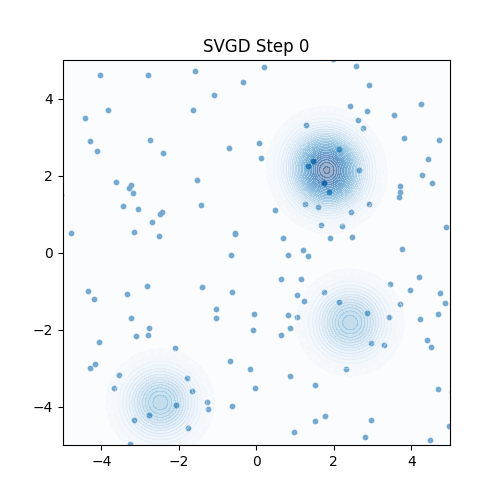
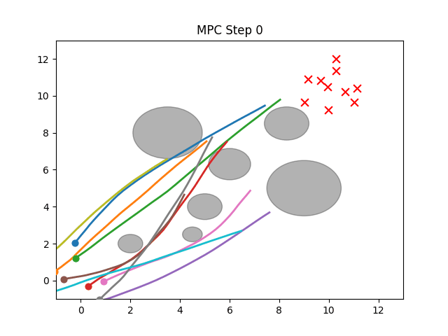

# Stein Variational Model Predictive Control (SV-MPC) for Robot Navigation (JAX Implementation)

This repository provides a **starter implementation of Stein Variational Model Predictive Control (SV-MPC)** (see the original paper: https://homes.cs.washington.edu/~bboots/files/SVMPC.pdf) implemented in **JAX**, demonstrated on a multi-robot navigation task.

Stein Variational Gradient Descent (SVGD) is a particle-based, deterministic variational inference algorithm that transports a set of particles to approximate a target distribution p(x). Instead of fitting a single parametric approximation, SVGD evolves a set of particles using a functional gradient step that combines two forces:

- attraction toward regions of high probability, and
- repulsion between particles (via a positive-definite kernel) to maintain diversity and avoid mode collapses.

The SVGD update for a particle x_i has the form:

$$
x_i \leftarrow x_i + \epsilon \frac{1}{n} \sum_{j=1}^n \big[k(x_j, x_i) \nabla_{x_j} \log p(x_j) + \nabla_{x_j} k(x_j, x_i)\big],
$$

where $k(\cdot,\cdot)$ is a kernel (we use an RBF kernel) and $\epsilon$ is a small step size. For more information, please check out the paper: https://arxiv.org/pdf/1608.04471

How this repo uses SVGD

We treat candidate control trajectories (or control inputs) as particles and define a log-probability proportional to a negative cost (trajectory cost, collision penalties, goal terms). SVGD is then used to evolve the particles towards low-cost (high-probability) regions. 


---

## Features

- **JAX-based implementation** allowing fast, differentiable, and GPU-accelerated computation.
- **Stein variational gradient descent (SVGD)** on the control inputs of robots for trajectory optimization.
- **Double-integrator** robot dynamics with obstacle and inter-agent collision avoidance.
- **Modular design** separating configuration, kernel definition, log probability, and visualization.  
- **Visualization utilities** for robot trajectories, goal locations, and obstacle fields.  
- **Easily extensible** to different kernels, log-probability functions, or dynamic environments.


## Examples

A simple 2D Gaussian mixture test and animation is provided in `examples/gaussian_2d_test.py` to visualize the SVGD steps.

This example initializes particles from a Gaussian, runs SVGD on the particles to match the target distribution (which is a randomly generated 2D Gaussian mixture model). 

Quick steps to run the example (from the repository root):

```sh
# (optional) create and activate a virtualenv
python3 -m venv .venv
. .venv/bin/activate

# install dependencies
pip install -r requirements.txt

# run the 2D gaussian test and animation
python3 examples/gaussian_2d_test.py
```

If everything runs correctly you should see an animation similar to the one shown below (example included at `examples/2d_example.gif`):



## Running Instructions


### Multi-robot simulation

To run the full multi-robot trajectory planning simulation and see the animated robot trajectories, simply run:

```sh
python3 robot_navigation_sim.py
```

If everything runs correctly you should see an animation similar to the one shown below (example included at `examples/multi_robot_sim.gif`):



This script uses the parameters in `config.py` and the SVGD implementation in `svgd.py` to plan and animate trajectories for multiple robots, showing goals, obstacles, and sampled/control trajectories. If you want a faster run for testing, reduce `TIME_ITER`, `SVGD_ITER`, or `NUM_PARTICLE` in `config.py`.


